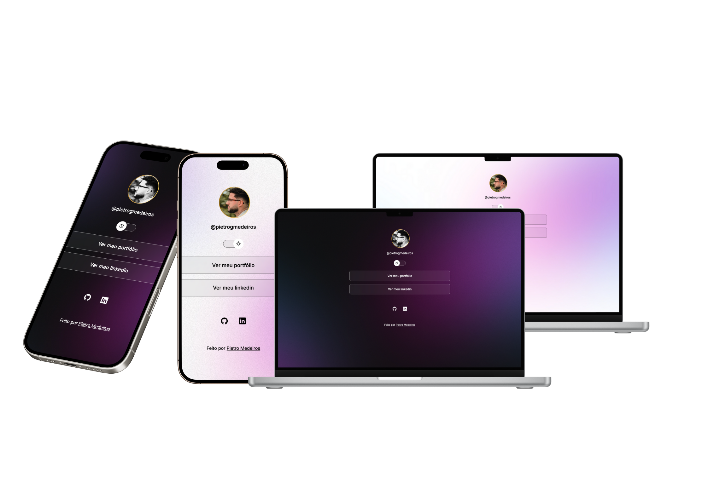

# Projeto Profile Links 🚀

## 📝 Descrição

Este é um projeto simples e elegante que funciona como uma página de links centralizada (semelhante ao Linktree), ideal para agrupar seus perfis sociais e profissionais em um único lugar. A interface é limpa, interativa e totalmente responsiva.

---

## ✨ Funcionalidades Principais

-   **🔗 Links Centralizados**: Botões que direcionam para perfis importantes como GitHub e LinkedIn.
-   **🎨 Tema Dinâmico**: Uma funcionalidade de troca de tema (light/dark mode) que altera o esquema de cores da página e até mesmo a foto de perfil, proporcionando uma experiência visual agradável.
-   **🖱️ Ícones Interativos**: Além dos botões, ícones sociais também estão disponíveis para acesso rápido aos links.
-   **📱 Design Responsivo**: A interface se adapta perfeitamente a qualquer tamanho de tela, seja em desktops, tablets ou celulares.

---

## 🚀 Tecnologias Utilizadas

O projeto foi construído utilizando as seguintes tecnologias:

-   
-   
-   

---
## 📬 Contato

Desenvolvido por Pietro Medeiros. Entre em contato!

